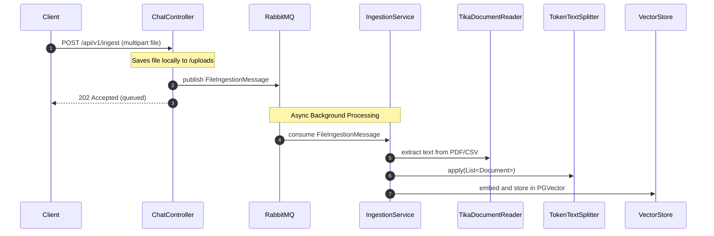
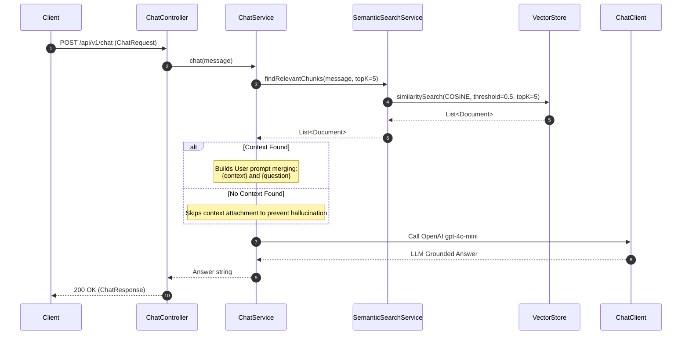

# FinPulse AI - Agentic Financial Intelligence System
## Agent Onboarding & Context Injector

This document provides a highly structured, comprehensive, and technical blueprint of the **FinPulse AI** repository. It serves as an instant context-injector for specialized AI sub-agents to understand the architecture, data flow, tech stack, and conventions without scanning the entire codebase.

---

### 1. System Overview & Purpose
**FinPulse AI** is an enterprise-grade Agentic Financial Intelligence System designed to perform Retrieval-Augmented Generation (RAG) over dense financial documents.
- **Core Value Proposition**: Enables financial analysts to query complex datasets with high precision, obtaining answers strictly grounded in the ingested documents, complete with precise source-file citations.
- **Key Constraints**: 
  - **Zero Hallucination**: Strict instruction sets to prevent the LLM from synthesizing numerical data or drawing conclusions outside the provided context.
  - **Asynchronous Processing**: Prevents UI blocking during massive document ingestion by leveraging message queues.

---

### 2. Tech Stack & Dependencies
The application is built on a modern, high-performance Java/Spring stack, leveraging advanced AI integration patterns:

*   **Core Platform**: Java 21, Spring Boot 3.4.1
*   **AI Integration Layer**:
    *   **Spring AI 1.0.0**: Core framework for AI integrations.
    *   **OpenAI API**: `gpt-4o-mini` (Chat) and `text-embedding-3-small` (Embeddings).
    *   **Apache Tika**: Natively parses complex formats (PDF, CSV, Word) via `spring-ai-tika-document-reader`.
*   **Data & Queues**:
    *   **PostgreSQL 16 (with `pgvector`)**: Stores dense embedding vectors and handles `COSINE_DISTANCE` semantic search.
    *   **RabbitMQ 3**: Message broker handling asynchronous background file ingestion (`spring-boot-starter-amqp`).
*   **Infrastructure & Frontend**:
    *   **Docker Compose**: Automates local infrastructure spin-up (PostgreSQL and RabbitMQ).
    *   **Vanilla HTML/JS/CSS**: A beautiful glassmorphism SPA served from `src/main/resources/static`.

---

### 3. Architecture & File Structure
The project follows a clean, layered architectural pattern:

```text
finpulse-ai/
├── compose.yml                         # Docker compose for PostgreSQL (pgvector) and RabbitMQ
├── pom.xml                             # Project dependencies
├── agent.md                            # AI agent onboard context file (this file)
└── src/
    ├── main/
    │   ├── java/
    │   │   └── com/finpulse/finpulse_ai/
    │   │       ├── FinpulseAiApplication.java
    │   │       ├── config/
    │   │       │   └── RabbitMQConfig.java       # Defines ingestion.queue and exchanges
    │   │       ├── controller/
    │   │       │   └── ChatController.java       # HTTP REST Endpoints (/api/v1)
    │   │       ├── dto/                          # Immutable Data Transfer Objects (Java Records)
    │   │       │   └── FileIngestionMessage.java # RabbitMQ queued job payload
    │   │       └── service/                      # Core business & AI orchestration logic
    │   │           ├── ChatService.java          # RAG pipeline & LLM prompt execution
    │   │           ├── IngestionService.java     # RabbitListener for Async Tika parsing & vector store
    │   │           └── SemanticSearchService.java # High-performance vector database querying
    │   └── resources/
    │       ├── application.properties  # App configurations
    │       └── static/                 # Glassmorphism UI (index.html, styles.css, app.js)
```

---

### 4. Data Flow & State Management

#### A. Asynchronous Document Ingestion Pipeline


#### B. RAG Retrieval & Prompting Pipeline


---

### 5. Strict Conventions & Rules

#### Code Styling & Patterns
*   **Immutability**: All DTOs *must* be Java `record` classes.
*   **Dependency Injection**: Use **constructor-based dependency injection** via Lombok’s `@RequiredArgsConstructor`.
*   **Asynchronous Jobs**: Do not block HTTP threads for file parsing. Always utilize RabbitMQ for heavy processing.

#### Error Handling & Robustness
*   **RAG Guardrails**: `SemanticSearchService` maintains a strict similarity threshold of `0.5` to eliminate irrelevant context from bloating the prompt payload.
*   **File Cleanup**: The `IngestionService` ensures local temporary files in `/uploads` are deleted after vectorization.

---

### 6. Current Roadmap & Active Context
The immediate roadmap targets expanding **FinPulse AI** into a more feature-rich product:

1.  **Conversational Memory / State Management**:
    *   Integrating chat history (Redis/Spring AI conversational history) to support stateful context windows, enabling follow-up analytical questions.
2.  **Financial Tool Calling (Agentic)**:
    *   Equipping the `ChatClient` with Spring AI custom function calling to execute formula computations dynamically (e.g., CAGR, Margins).
3.  **Token Streaming (SSE)**:
    *   Transitioning `/api/v1/chat` to `Flux<String>` to stream answers token-by-token directly to the UI.
