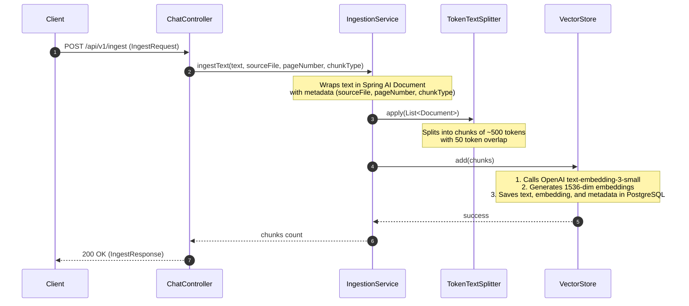
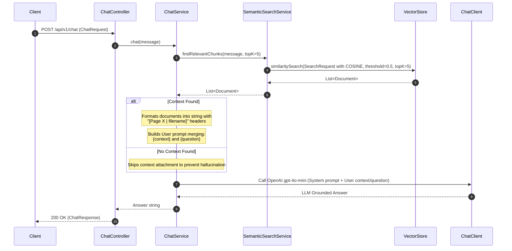

# FinPulse AI - Agentic Financial Intelligence System
## Agent Onboarding & Context Injector

This document provides a highly structured, comprehensive, and technical blueprint of the **FinPulse AI** repository. It serves as an instant context-injector for specialized AI sub-agents to understand the architecture, data flow, tech stack, and conventions without scanning the entire codebase.

---

### 1. System Overview & Purpose
**FinPulse AI** is an enterprise-grade Agentic Financial Intelligence System designed to perform Retrieval-Augmented Generation (RAG) over dense financial documents (e.g., annual reports, earnings call transcripts, financial statements). 
- **Core Value Proposition**: Enables financial analysts to query complex datasets with high precision, obtaining answers strictly grounded in the ingested documents, complete with precise source-file and page-number citations.
- **Key Constraints**: 
  - **Zero Hallucination**: Strict instruction sets to prevent the LLM from synthesizing numerical data or drawing conclusions outside the provided context.
  - **Traceability**: All synthesized responses must reference original source documents and page numbers.
  - **Structure Awareness**: Differentiates between raw narrative text and financial tabular data during both ingestion and retrieval.

---

### 2. Tech Stack & Dependencies
The application is built on a modern, high-performance Java/Spring stack, leveraging advanced AI integration patterns:

*   **Core Platform**: 
    *   **Java 21**: Leveraging modern language features (e.g., `records`, enhanced switch expressions, pattern matching).
    *   **Spring Boot 3.4.1**: Provides the underlying application framework, dependency injection, and REST capabilities.
*   **AI Integration Layer**:
    *   **Spring AI 1.0.0 (BOM-managed)**: Core framework for AI integrations (models, vector stores, splitters).
    *   **OpenAI API**:
        *   **Chat/Reasoning Model**: `gpt-4o-mini` (configured via `spring.ai.openai.chat.options.model`).
        *   **Embeddings Model**: `text-embedding-3-small` (1536 dimensions) for producing semantic vectors.
*   **Vector & Relational Database**:
    *   **PostgreSQL 16 (with `pgvector` extension)**: Used as both the transactional database and vector store for dense embedding lookups.
    *   **Spring AI Vector Store PGVector**: Integrates database storage with semantic distance search (`COSINE_DISTANCE` with a `0.5` similarity threshold).
*   **Infrastructure & Utilities**:
    *   **Docker Compose**: Automates local infrastructure spin-up (PostgreSQL container running `pgvector/pgvector:pg16`).
    *   **Spring Boot Docker Compose Support**: Automatically boots, verifies, and integrates the containerized PostgreSQL database on application start.
    *   **Project Lombok**: Minimizes boilerplate code (e.g., `@RequiredArgsConstructor`, `@Slf4j`).
*   **Testing Suite**:
    *   **JUnit 5 (Jupiter)**: Test execution framework.
    *   **Spring Boot Starter Test**: Core integration and unit testing framework.
    *   **Testcontainers PostgreSQL**: Spins up isolated, clean Docker databases for reproducible integration testing.

---

### 3. Architecture & File Structure
The project follows a clean, layered architectural pattern standard in Spring Boot enterprise projects:

```text
finpulse-ai/
├── .mvn/                               # Maven wrapper configuration
├── compose.yml                         # Docker compose for PostgreSQL pgvector database
├── mvnw                                # Maven wrapper script
├── pom.xml                             # Project object model & dependency tree
├── agent.md                            # AI agent onboard context file (this file)
└── src/
    ├── main/
    │   ├── java/
    │   │   └── com/
    │   │       └── finpulse/
    │   │           └── finpulse_ai/
    │   │               ├── FinpulseAiApplication.java    # Application entry point
    │   │               ├── controller/
    │   │               │   └── ChatController.java       # HTTP REST Endpoints (/api/v1)
    │   │               ├── dto/                          # Immutable Data Transfer Objects (Java Records)
    │   │               │   ├── ChatRequest.java          # Message payload record
    │   │               │   ├── ChatResponse.java         # AI response payload record
    │   │               │   ├── IngestRequest.java        # Text/Table ingestion record
    │   │               │   └── IngestResponse.java       # Ingestion confirmation record
    │   │               └── service/                      # Core business & AI orchestration logic
    │   │                   ├── ChatService.java          # RAG pipeline & LLM prompt execution
    │   │                   ├── IngestionService.java     # Document splitting & embedding generation
    │   │                   └── SemanticSearchService.java # High-performance vector database querying
    │   └── resources/
    │       ├── application.properties  # App configurations (ports, model definitions, vector store specs)
    │       ├── static/                 # Static assets (UI)
    │       └── templates/              # Server-side templates (if any)
    └── test/
        └── java/
            └── com/
                └── finpulse/
                    └── finpulse_ai/
                        └── FinpulseAiApplicationTests.java # Context loading integration tests
```

---

### 4. Data Flow & State Management
The system operates as a stateless REST service with state fully persisted in the PostgreSQL PGVector database. The two main pipelines are **Ingestion** and **Retrieval (RAG)**:

#### A. Document Ingestion Pipeline


#### B. RAG Retrieval & Prompting Pipeline


---

### 5. Strict Conventions & Rules

#### Code Styling & Patterns
*   **Immutability**: All Data Transfer Objects (DTOs) *must* be implemented as Java `record` classes to guarantee thread safety and immutability. See `com.finpulse.finpulse_ai.dto`.
*   **Dependency Injection**: Use **constructor-based dependency injection**. Avoid field injection (`@Autowired`). Standardize this using Lombok’s `@RequiredArgsConstructor` annotation at the class level on `@Service` and `@RestController` components.
*   **Logging**: Use Lombok's `@Slf4j` for class-level logger generation. Never use `System.out.println()`.
*   **API Design**: Prefix all REST controllers with `/api/v1` using `@RequestMapping("/api/v1")`. Endpoints must utilize explicit HTTP verbs (`@PostMapping`, `@GetMapping`).

#### Naming Conventions
*   **Class Names**: UpperCamelCase (e.g., `SemanticSearchService`, `ChatController`).
*   **Method & Variables**: lowerCamelCase (e.g., `findRelevantChunks`, `sourceFile`).
*   **Package Structure**: Lowercase with dot notation. The specific codebase package root is `com.finpulse.finpulse_ai`.
*   **Database Schema**: Under the hood, Spring AI vector schema uses lowercase underscore mapping for metadata keys (`page_number`, `source_file`, `chunk_type`).

#### Error Handling & Robustness
*   **Validation**: Controller inputs should fail fast.
*   **Null Safety**: Make use of standard Java validation and Spring AI nullability contracts.
*   **RAG Guardrails**:
    *   The `SemanticSearchService` maintains a strict similarity threshold of `0.5` to eliminate irrelevant context from bloating the prompt payload.
    *   `ChatService` implements fallback mechanics. If zero matching chunks are retrieved, it proceeds with a specific prompt configuration rather than injecting empty tables, ensuring the system returns a safe, pre-configured failure response: *"I could not find this information in the uploaded documents."*

#### Testing Requirements
*   All integrations with PostgreSQL must test both schema migration and Vector operations.
*   Use JUnit 5 for tests.
*   Leverage Spring Boot's `@SpringBootTest` alongside `Testcontainers` to ensure that a real pgvector database runs isolated inside a Docker container during unit and integration test phases.

---

### 6. Current Roadmap & Active Context
The immediate roadmap targets expanding **FinPulse AI** into a robust multi-agent orchestration service:

1.  **Multi-Format Ingestion Engine**:
    *   Implementing native Apache Tika / Spring AI document readers to ingest PDFs (10-K filings, QBR decks) and CSV files directly from `/api/v1/ingest`.
2.  **Conversational Memory / State Management**:
    *   Integrating chat history (`spring-ai` conversational history store) to support stateful context windows, enabling follow-up analytical questions.
3.  **Financial Tool Calling**:
    *   Equipping the `ChatClient` with Spring AI custom function calling (tools) to execute formula computations (e.g., calculating CAGR, Debt-to-Equity ratios, or Operating Margins) dynamically when tabular data is referenced.
